# DualBand-RingID: 双频带水印识别系统

> 基于 Tree-Ring 和 RingID 的多供应商图像水印识别与鲁棒性增强研究

## 项目简介

本项目是一个完整的图像水印系统，结合了频域水印技术、多密钥识别能力和抗攻击增强方法。项目基于 [Tree-Ring Watermark](https://github.com/YuxinWenRick/tree-ring-watermark) 和 [RingID](http://arxiv.org/abs/2404.14055) 论文，并引入了 [PAI (Path-Aware Injection)](https://arxiv.org/abs/2601.06639) 语义偏转技术。

### 团队分工

| 成员 | 研究方向 | 主要贡献 |
|------|----------|----------|
| **成员 A** | 双频带策略 + PAI 集成 | 提出双频带水印方案，实现 PAI 语义偏转增强抗篡改能力 |
| **成员 B** | 多密钥识别验证 | 在 RingID 框架下验证双频带策略，探索密钥容量和偏转效果 |
| **成员 C** | 图像质量评估 | 实现 PSNR/SSIM 质量检测，评估不同频段策略的视觉影响 |
| **成员 D** | 数据汇总与报告撰写 | 整合实验数据，生成可视化图表，撰写技术报告初稿 |

### 技术路线

```
Tree-Ring 单密钥验证 (成员 A)
    ↓
双频带策略提出 (Low-Freq + High-Freq)
    ↓
PAI 语义偏转集成 (抗篡改增强)
    ↓
RingID 多密钥识别验证 (成员 B)
    ↓
图像质量评估 (成员 C)
    ↓
数据汇总与报告撰写 (成员 D)
```

### 协作流程

```mermaid
graph LR
    A[成员 A: 生成水印图像] --> C[成员 C: 质量评估]
    A --> B[成员 B: 多密钥识别]
    B --> D[成员 D: 数据汇总]
    C --> D
    D --> E[技术报告]
```



| 阶段 | 输入 | 输出 | 负责人 |
|------|------|------|--------|
| 1. 水印生成 | Prompts | 带水印图像 | A |
| 2. 质量评估 | 带水印图像 | PSNR/SSIM 数据 | C |
| 3. 识别验证 | 带水印图像 | 识别准确率、混淆矩阵 | B |
| 4. 数据汇总 | 所有实验数据 | 统计分析、可视化图表 | D |
| 5. 报告撰写 | 汇总数据 | 技术报告 | D |

## 核心研究成果

### 关键发现总结

| 发现 | 描述 | 贡献者 |
|------|------|--------|
| 🎯 **双频带优于单频** | 在 Tree-Ring 和 RingID 两种场景下均验证有效 | A + B + D |
| 📊 **容量上限 20-30** | 实用多密钥识别容量为 20-30 个供应商 | B + D |
| ⚖️ **PAI Trade-off** | PAI 在单密钥场景增强鲁棒性，但在多密钥场景降低准确率 | A + B + D |
| 🖼️ **视觉质量保持** | 双频带策略 PSNR > 40dB，SSIM > 0.97，视觉无损 | C + D |

### 1. 双频带策略 (成员 A 提出 + 成员 B 验证)

#### Tree-Ring 场景 (单密钥验证)
| 策略 | PSNR (dB) | SSIM | 视觉质量 |
|------|-----------|------|----------|
| 低频 (R=3-7) | 42.15 | 0.9876 | 高 |
| 高频 (R=8-14) | 38.92 | 0.9654 | 中 |
| **双频带 (R=3-14)** | **40.58** | **0.9782** | **优** ✓ |

**成员 C 评估结论**：双频带策略在保持高视觉质量的同时，兼顾了鲁棒性。

#### RingID 场景 (多密钥识别)
| 策略 | Clean | C&S75 | 平均准确率 |
|------|-------|-------|------------|
| 低频 (R=3-7) | 100% | 88% | 97.7% |
| 高频 (R=8-14) | 100% | 80% | 96.6% |
| **双频带 (R=3-14)** | 100% | **90%** | **98.3%** ✓ |

**成员 B 验证结论**：双频带策略在多供应商识别场景下**同样表现最优**，验证了其普适性。

### 2. 密钥容量测试 (成员 B)

| 密钥数 | 平均准确率 | C&S75 |
|--------|------------|-------|
| 5 | 98.3% | 90% |
| 10 | 96.4% | 78% |
| 20 | 95.4% | 71% |
| 30 | 93.4% | 58% |
| 50 | 91.7% | 48% |

**结论**：实用密钥容量为 **20-30** 个供应商。

### 3. PAI 语义偏转 (成员 A 实现 + 成员 B 评估)

#### 单密钥验证场景 (Tree-Ring)
| 攻击类型 | 无 PAI | 有 PAI | 提升 |
|----------|--------|--------|------|
| 高斯噪声 | 0.72 | 0.85 | +18% |
| 高斯模糊 | 0.68 | 0.81 | +19% |
| JPEG 压缩 | 0.65 | 0.79 | +22% |

**成员 A 结论**：PAI 显著增强抗攻击能力。

#### 多密钥识别场景 (RingID)
| 配置 | C&S75 | 平均准确率 |
|------|-------|------------|
| **Baseline (无偏转)** | **90%** | **98.3%** |
| 偏转 (s=5, m=0.1) | 84% | 97.4% |
| 偏转 (s=5, m=0.3) | 78% | 96.1% |

**成员 B 发现**：在多密钥识别场景下，路径偏转与识别准确率存在 **trade-off**。

| 场景 | 偏转效果 | 适用性 |
|------|----------|--------|
| 单密钥验证 (Tree-Ring) | ✅ 显著提升抗攻击 | 推荐使用 |
| 多密钥识别 (RingID) | ⚠️ 降低识别准确率 | 需权衡 |

## 环境配置

### 系统要求
- Python 3.8+
- CUDA 11.0+ (推荐 RTX 4060 8GB 或更高)
- 20GB+ 磁盘空间

### 安装依赖

```bash
# 创建虚拟环境
conda create -n dualband python=3.8
conda activate dualband

# 安装依赖
pip install torch torchvision --index-url https://download.pytorch.org/whl/cu118
pip install diffusers==0.11.1 transformers==4.23.1
pip install numpy tqdm pillow xformers accelerate safetensors
pip install opencv-python scikit-image  # 用于图像质量评估
```

### 模型下载

下载 Stable Diffusion 2.1 Base 模型：
```bash
# 方法 1: 使用 Hugging Face
from diffusers import StableDiffusionPipeline
pipe = StableDiffusionPipeline.from_pretrained("stabilityai/stable-diffusion-2-1-base")
pipe.save_pretrained("./models/stable-diffusion-2-1-base")

# 方法 2: 手动下载
# 下载地址: https://huggingface.co/stabilityai/stable-diffusion-2-1-base
```

### Prompt 数据集

下载 [Gustavosta/Stable-Diffusion-Prompts](https://huggingface.co/datasets/Gustavosta/Stable-Diffusion-Prompts) 或使用项目提供的 `prompts_for_alignment.txt`。

## 使用方法

### 快速开始（5 分钟体验）

```bash
# 1. 生成带水印图像
python shuiyin.py

# 2. 评估图像质量
python test.py

# 3. 运行多密钥识别
python identify.py --run_name quickstart --trials 10 --assigned_keys 5 --gpu_id 0
```

### 详细实验指南

#### 实验 1: 双频带水印生成 (成员 A)

**基础版本**：
```bash
python shuiyin.py
```
配置说明：
- 自动生成 Low-Freq、High-Freq、Dual-Ring 三种策略
- 默认生成 50 张图像
- 结果保存至 `tree_ring_results/`

**PAI 增强版本**：
```bash
python PAI.py
```
配置说明：
- 集成语义偏转技术
- 增强抗攻击能力
- 结果保存至 `pai_results/`

#### 实验 2: 图像质量评估 (成员 C)

```bash
python test.py
```

输出示例：
```
Folder Name     | Avg PSNR (dB)   | Avg SSIM
---------------------------------------------
Dual-Ring       |         40.5823 |     0.9782
Low-Freq        |         42.1534 |     0.9876
High-Freq       |         38.9245 |     0.9654
```

#### 实验 3: 多密钥识别测试 (成员 B)

**3.1 频段策略对比**
```bash
python scripts/frequency_band_test.py --gpu 0
```
- 对比 Low-Freq、High-Freq、Dual-Band 三种策略
- 生成对比报告至 `runs/frequency_band_comparison/`

**3.2 密钥容量测试**
```bash
python scripts/key_capacity_test.py --keys 5,10,20,30,50 --gpu 0
```
- 测试不同密钥数量下的识别准确率
- 生成容量曲线至 `runs/key_capacity_test/`

**3.3 PAI 偏转效果评估**
```bash
# Baseline (无偏转)
python identify.py --use_deflection 0 --assigned_keys 5 --trials 100 --gpu_id 0

# 单次偏转实验
python identify.py --use_deflection 1 --deflection_steps 5 --deflection_strength 0.3 \
    --assigned_keys 5 --trials 100 --gpu_id 0

# 批量偏转实验（不同参数组合）
bash scripts/run_deflection_experiments.sh
```

**3.4 生成混淆矩阵**
```bash
python scripts/generate_confusion_matrix.py --run_dir runs/2026_01_13_11_56_25_multi_key_5vendors_v2
```

#### 实验 4: 数据汇总与可视化 (成员 D)

**汇总所有实验结果**：
```bash
# 收集所有 log.csv 文件
find runs/ -name "log.csv" -exec cat {} \; > all_results.csv

# 生成可视化图表（需要自定义脚本）
python scripts/generate_plots.py --input all_results.csv --output figures/
```

**生成技术报告**：
- 中文报告：`docs/Identifiability_CN.md`
- 英文报告：`docs/Identifiability_EN.md`

## 项目结构

```
DualBand-RingID/
├── shuiyin.py                  # 成员 A: Tree-Ring 双频带水印生成
├── PAI.py                      # 成员 A: PAI 语义偏转增强版本
├── test.py                     # 成员 C: 图像质量评估 (PSNR/SSIM)
├── identify.py                 # 成员 B: 多密钥识别主程序
├── utils.py                    # 核心工具函数
├── inverse_stable_diffusion.py # DDIM 逆向推理
├── modified_stable_diffusion.py# 修改版 SD pipeline
├── io_utils.py                 # 输入输出工具
├── scripts/
│   ├── frequency_band_test.py  # 成员 B: 频段对比实验
│   ├── key_capacity_test.py    # 成员 B: 密钥容量测试
│   ├── run_deflection_experiments.sh  # 成员 B: PAI 偏转批量实验
│   ├── generate_confusion_matrix.py   # 成员 B: 混淆矩阵生成
│   └── generate_plots.py       # 成员 D: 数据可视化脚本
├── docs/
│   ├── Identifiability_CN.md   # 成员 D: 中文技术报告
│   └── Identifiability_EN.md   # 成员 D: 英文技术报告
├── 生成模型基础报告/
│   ├── main.tex                # 成员 D: LaTeX 报告源文件
│   └── picture/                # 成员 D: 报告图表
├── runs/                       # 实验结果目录
│   ├── frequency_band_comparison/  # 频段对比结果
│   ├── key_capacity_test/          # 容量测试结果
│   └── 2026_01_*_*/                # 各次实验运行记录
├── tree_ring_results/          # 成员 A: Tree-Ring 生成结果
├── pai_results/                # 成员 A: PAI 增强结果
├── models/                     # Stable Diffusion 模型
├── sd_prompts_dataset/         # Prompt 数据集
└── requirements.txt            # 依赖列表
```

## 技术细节

### 双频带策略原理

传统 Tree-Ring 水印仅使用单一频段（通常是低频），存在以下问题：
- **低频**：鲁棒性强但容易被压缩攻击破坏
- **高频**：抗压缩但容易被模糊攻击破坏

**双频带方案**结合两者优势：
```
低频环 (R=3-7)  ← 抗模糊、抗几何变换
     +
高频环 (R=8-14) ← 抗压缩、抗噪声
     ↓
双频带水印 (R=3-14) ← 综合鲁棒性最优
```

### PAI 语义偏转机制

PAI (Path-Aware Injection) 通过在扩散过程中注入感知加权的频域信号，实现：
1. **语义保持**：通过感知权重 λ_p 确保生成图像语义不变
2. **抗篡改增强**：偏转扩散路径，使攻击者难以移除水印
3. **频域对齐**：确保注入信号与原始频谱功率密度匹配

核心公式：
```
W(f) = (1 - α·M_s·M_p)·L(f) + α·M_s·M_p·T(f)
```
其中：
- `L(f)`: 原始潜变量频域表示
- `T(f)`: 目标水印 Patch
- `M_s`: 空间掩码（频段选择）
- `M_p`: 感知权重（保护重要频率）
- `α`: 注入强度

### 多密钥识别算法

RingID 使用 DDIM 逆向 + 频域相似度匹配：
```python
1. 对待检测图像进行 DDIM 逆向，得到初始潜变量
2. 提取潜变量的频域特征
3. 与所有候选密钥的目标 Patch 计算余弦相似度
4. 选择相似度最高的密钥作为识别结果
```

### 数据处理流程 (成员 D)

```
原始实验数据 (log.csv)
    ↓
数据清洗与整合
    ↓
统计分析 (均值、方差、置信区间)
    ↓
可视化生成 (曲线图、混淆矩阵、对比图)
    ↓
报告撰写 (Markdown + LaTeX)
```

## 文档与报告

### 技术报告
- [中文技术报告](docs/Identifiability_CN.md) - 详细的实验设计与结果分析
- [English Technical Report](docs/Identifiability_EN.md) - Detailed experimental design and analysis
- [LaTeX 报告源文件](生成模型基础报告/main.tex) - 学术论文格式报告

### 实验数据
所有实验结果保存在 `runs/` 目录下，包括：
- 原始日志文件 (`log.csv`)
- 混淆矩阵图像
- 可视化曲线图
- 统计分析结果

### 报告图表 (成员 D)
`生成模型基础报告/picture/` 目录包含所有报告图表：
- 频段对比图 (D1-D6)
- 容量测试曲线 (L1-L6)
- PAI 偏转效果图 (H1-H6)
- 质量评估对比 (O1-O6, P1-P3)
- 混淆矩阵 (confusion_matrix.png)

## 引用

如果本项目对您的研究有帮助，请引用以下论文：

```bibtex
@article{wen2023tree,
  title={Tree-Ring Watermarks: Fingerprints for Diffusion Images that are Invisible and Robust},
  author={Wen, Yuxin and Kirchenbauer, John and Geiping, Jonas and Goldstein, Tom},
  journal={arXiv preprint arXiv:2305.20030},
  year={2023}
}

@article{zhang2024ringid,
  title={RingID: Rethinking Tree-Ring Watermarking for Enhanced Multi-Key Identification},
  author={Zhang, Hai and others},
  journal={arXiv preprint arXiv:2404.14055},
  year={2024}
}

@article{liu2025pai,
  title={Attack-Resistant Watermarking for AIGC Image Forensics via Diffusion-based Semantic Deflection},
  author={Liu, Yunming and others},
  journal={arXiv preprint arXiv:2601.06639},
  year={2025}
}
```

## 致谢

本项目基于以下开源工作：
- [Tree-Ring Watermark](https://github.com/YuxinWenRick/tree-ring-watermark) - 原始 Tree-Ring 实现
- [Stable Diffusion](https://github.com/Stability-AI/stablediffusion) - 扩散模型基础
- [Diffusers](https://github.com/huggingface/diffusers) - Hugging Face 扩散模型库

感谢所有贡献者的辛勤工作！


